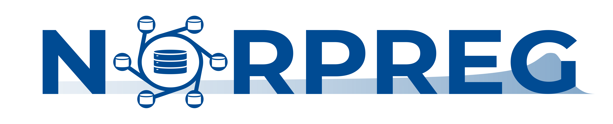

# Norsk proton- og stråleterapiregister (NORPREG)

Norsk proton- og stråleterapiregister (NORPREG) skal bidra til å måle effekten av protonbehandling. NORPREG sikrer tilgang til registeropplysninger for kvalitetsforbedring og forskning innen både foton- og protonterapi.

Registeret skal inneholde kliniske data og stråleterapidata fra kreftpasienter som får strålebehandling i Norge. Oppfølging av pasienter over lengre tid er en viktig del av registeret.  Informasjonen som registreres vil ha betydning for behandling og oppfølging av fremtidige kreftpasienter. Et sentralt mål er å styrke kunnskapen om moderne strålebehandling, inklusive akutte bivirkninger og seneffekter av behandlingen. Økt kunnskap vil kunne bidra til å bedre kvaliteten på strålebehandling som gis og samtidig stimulere til økt interesse og forskning innen fagfeltet  

Registerets formål er å legge til rette for kvalitetsarbeid, metodeutvikling og forskning innen stråleterapi. 

* Bidra til systematisk og persontilpasset langtidsoppfølging av pasienter som får strålebehandling
* Styrke kunnskapen om moderne strålebehandling (inkludert protoner), dens effekt og bivirkninger
* Bidra til like muligheter for alle sykehusene i Norge til stråleterapiforskning på nasjonalt og internasjonalt nivå
* Like muligheter for kvalitetsarbeid og sammenlignbare kvalitetsstudier mellom sykehus
* Frembringe og presentere styringsdata for ressursbruk og prioriteringer innenfor kreftomsorgen
